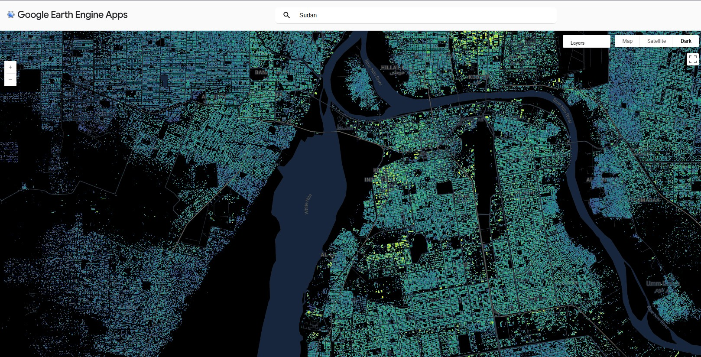

# 🏙️ **Introduction**

<h2 style="color: white; margin-top: 0;">🚀 Welcome to Building Heights Extraction</h2>

Unlock the power of Google's Open Buildings 2.5D Temporal dataset for urban analysis and planning

Google's **Open Buildings 2.5D Temporal dataset** is a groundbreaking resource that provides annual building presence, counts, and **height data** from 2016-2023. This comprehensive tutorial will guide you through multiple methods to access and visualize this data, with a focus on extracting building heights for use in QGIS and other GIS applications.

## 🎯 **What You'll Learn**

<h3 style="color: #667eea; margin-top: 0;">📊 Data Extraction</h3>

Extract building height rasters and vector data with precision and accuracy

<h3 style="color: #ff9500; margin-top: 0;">🗻 DSM Creation</h3>

Create Digital Surface Models (DSM) for comprehensive terrain analysis

<h3 style="color: #00c851; margin-top: 0;">🏢 Data Integration</h3>

Combine building footprints with height data for detailed urban mapping

<h3 style="color: #e91e63; margin-top: 0;">📱 3D Visualization</h3>

Visualize 2.5D buildings in QGIS with stunning 3D representations

<h3 style="color: #2196f3; margin-top: 0;">👁️ Analysis Tools</h3>

Perform visibility analysis and urban planning applications

---

<h3 style="text-align: center; margin: 0; color: #333;">🌟 Ready to get started?</h3>

Choose from three powerful extraction methods and transform your urban analysis workflow!

## 🔗 **Quick Navigation**

| Method | Difficulty | Best For |
|--------|------------|----------|
| [🛰️ Google Earth Engine](method-1-gee.md) | ⭐⭐⭐ | Large-scale processing |
| [🐍 Python Direct Download](method-2-python.md) | ⭐⭐ | Automated workflows |
| [🌐 Web Explorer](method-3-web-explorer.md) | ⭐ | Quick exploration |
