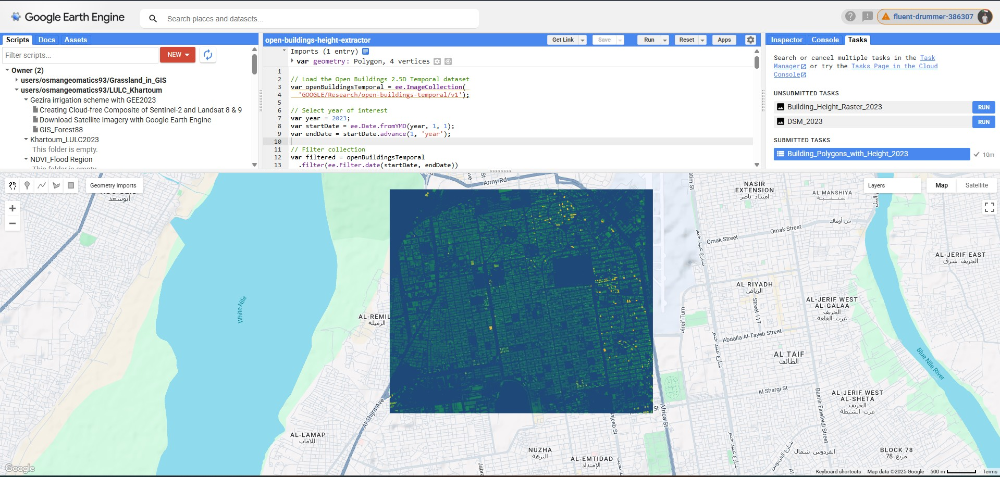

Method 1: Google Earth Engine (Recommended)
This is the most powerful method for processing large areas and combining with other datasets.

## Prerequisites

1. Sign up for Google Earth Engine: https://earthengine.google.com/signup/
2. Access the Code Editor: https://code.earthengine.google.com/

## Step 1: Extract Building Height Raster 

### Step 2: Create Digital Surface Model (DSM)

### Step 3: Extract Building Footprints with Heights

